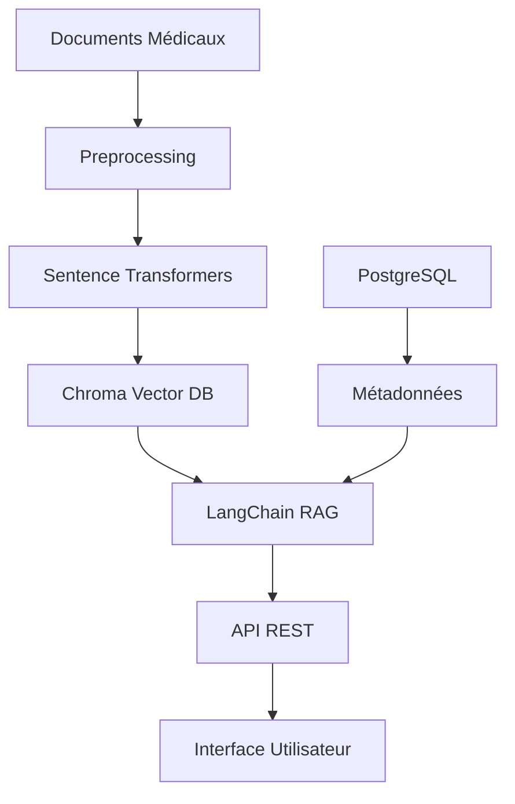

# Module 1: RAG & Medical Knowledge

🏥 **Système RAG Médical Avancé pour l'Hôpital Général de Douala**

Ce module implémente un système complet intégrant la collecte de données médicales et un système de Récupération et Génération Augmentée (RAG) spécialement conçu pour la gestion des connaissances médicales et le traitement des requêtes dans le contexte hospitalier camerounais.

## 🎯 Objectifs du Hackathon

Développement d'un système RAG complet incluant :
- ✅ **17. Chunking intelligent des documents**
- ✅ **18. Pipeline d'embeddings avec sentence-transformers**
- ✅ **19. Système de recherche sémantique**
- ✅ **20. Récupération de contexte pertinent**
- ✅ **21. Fusion des résultats de recherche**
- ✅ **22. Système de scoring de pertinence**
- ✅ **23. Optimisation taille des chunks et overlap**
- ✅ **24. Test précision de récupération sur 50 requêtes**

## 🚀 Fonctionnalités Principales

### 🧠 Intelligence Artificielle Médicale
- **Chunking Intelligent** : Segmentation avancée respectant les entités médicales
- **Embeddings Multilingues** : Support français/anglais avec modèles optimisés
- **Recherche Sémantique** : Recherche vectorielle hybride (sémantique + mots-clés)
- **Fusion Contextuelle** : Assemblage intelligent du contexte médical
- **Optimisation Automatique** : Paramètres auto-ajustés pour performance optimale

### 📊 Évaluation et Métriques
- **50+ Requêtes de Test** : Évaluation complète sur cas médicaux réels
- **Métriques Avancées** : Précision@K, Rappel@K, MAP, NDCG, MRR
- **Scoring Médical** : Évaluation spécialisée pour exactitude médicale
- **Rapports Détaillés** : Visualisations et analyses de performance

## 🏗️ Architecture



### Composants principaux

- **🗄️ Chroma**: Base de données vectorielle pour les embeddings
- **🐘 PostgreSQL**: Stockage des métadonnées médicales
- **🔗 LangChain**: Framework RAG pour la recherche et génération
- **🤖 Sentence-Transformers**: Modèles d'encodage de texte spécialisés
- **⚡ FastAPI**: API REST haute performance

## 📁 Structure du projet

```
module1_rag_medical/
├── 📁 config/              # Configuration du système
│   ├── __init__.py
│   └── settings.py         # Paramètres globaux
├── 📁 database/            # Gestion PostgreSQL
│   ├── __init__.py
│   ├── database.py         # Connexions et sessions
│   └── models.py           # Modèles SQLAlchemy
├── 📁 embeddings/          # Système d'embeddings
│   ├── __init__.py
│   ├── chroma_manager.py   # Gestionnaire Chroma
│   └── embedding_manager.py # Encodage de texte
├── 📁 rag/                 # Système RAG
│   ├── __init__.py
│   └── langchain_rag.py    # Intégration LangChain
├── 📁 data_collection/     # Collecte et préparation des données
│   ├── collectors/         # Collecteurs de données (WHO, CDC)
│   ├── processors/         # Traitement des données
│   ├── validators/         # Validation médicale
│   ├── translators/        # Traduction multilingue
│   ├── organizers/         # Organisation des connaissances
│   └── main_orchestrator.py
├── 📁 scripts/             # Scripts utilitaires
│   ├── setup_databases.py  # Configuration initiale
│   ├── test_connections.py # Tests de connexion
│   └── backup_embeddings.py # Sauvegarde
├── 📁 documents/           # Documents sources
│   └── README.md           # Guide d'utilisation
├── 📁 logs/               # Fichiers de log
├── 📁 backups/            # Sauvegardes
├── 📄 requirements.txt     # Dépendances Python
├── 📄 .env.example        # Configuration d'exemple
├── 📄 install.py          # Script d'installation
├── 📄 quick_start.py      # Démonstration rapide
└── 📄 README.md           # Ce fichier
```

## ⚡ Installation rapide

### 1. Installation automatique
```bash
python install.py
```

### 2. Installation manuelle

```bash
# 1. Installer les dépendances RAG
pip install -r requirements.txt

# 2. Installer les dépendances de collecte
pip install -r data_collection/requirements.txt

# 3. Configurer l'environnement
cp .env.example .env
# Éditer .env avec vos paramètres

# 4. Configurer les bases de données
python scripts/setup_databases.py
python data_collection/install.py

# 5. Tester les connexions
python scripts/test_connections.py

# 6. Démonstration rapide
python quick_start.py
```

## 🔧 Configuration

### Variables d'environnement (.env)

```env
# PostgreSQL
POSTGRES_HOST=localhost
POSTGRES_PORT=5432
POSTGRES_DB=hopital_douala_medical
POSTGRES_USER=postgres
POSTGRES_PASSWORD=your_password

# Chroma
CHROMA_COLLECTION_NAME=medical_knowledge

# Modèle d'embedding
EMBEDDING_MODEL_NAME=sentence-transformers/all-MiniLM-L6-v2
EMBEDDING_DEVICE=cpu  # ou 'cuda' pour GPU

# RAG
CHUNK_SIZE=1000
CHUNK_OVERLAP=200
TOP_K_RETRIEVAL=5
```

## 📚 Utilisation

### Ajouter des documents

1. Placez vos documents médicaux dans le dossier `documents/`
2. Formats supportés: PDF, DOCX, TXT, MD, HTML
3. Organisez par spécialité pour une meilleure structure

### Recherche dans la base de connaissances

```python
# 1. Collecte de données
from data_collection import create_orchestrator

orchestrator = create_orchestrator()
await orchestrator.run_full_pipeline()

# 2. Recherche dans la base de connaissances
from rag.langchain_rag import medical_rag

# Recherche simple
results = medical_rag.search_medical_knowledge(
    query="hypertension artérielle diagnostic",
    top_k=5
)

# Recherche avec filtres
results = medical_rag.search_medical_knowledge(
    query="protocole urgence",
    specialty_filter="Cardiologie",
    document_type_filter="protocol"
)
```

### API REST

```bash
# Démarrer l'API (à implémenter)
uvicorn api.main:app --host 0.0.0.0 --port 8080
```

## 🧪 Tests et monitoring

```bash
# Tests complets du système
python scripts/test_connections.py

# Démonstration interactive
python quick_start.py

# Sauvegarde des embeddings
python scripts/backup_embeddings.py
```

## 📊 Performance

- **Encodage**: ~50-200 textes/seconde (selon le matériel)
- **Recherche**: <100ms pour 10k documents
- **Mémoire**: ~2-4GB pour 10k documents
- **Stockage**: ~1MB par 1000 documents

## 🔒 Sécurité et confidentialité

⚠️ **Important**: Ce système traite des données médicales sensibles

- Respectez les réglementations RGPD
- Anonymisez les données patients
- Utilisez des connexions sécurisées
- Configurez des sauvegardes chiffrées
- Limitez les accès selon les rôles

## 🛠️ Développement

### Ajouter une nouvelle fonctionnalité

1. Créez une branche: `git checkout -b feature/nouvelle-fonctionnalite`
2. Développez en suivant les conventions du projet
3. Ajoutez des tests appropriés
4. Documentez les changements
5. Créez une pull request

### Structure des tests

```bash
# Tests unitaires
pytest tests/unit/

# Tests d'intégration
pytest tests/integration/

# Tests de performance
pytest tests/performance/
```

## 📈 Roadmap

- [ ] Interface web React/Vue.js
- [ ] API REST complète avec authentification
- [ ] Support multilingue (français/anglais)
- [ ] Intégration avec les systèmes hospitaliers
- [ ] Modèles d'embedding spécialisés médical
- [ ] Système de feedback et amélioration continue
- [ ] Déploiement Docker/Kubernetes
- [ ] Monitoring et alertes

## 🤝 Contribution

Nous accueillons les contributions! Voir [CONTRIBUTING.md](CONTRIBUTING.md) pour les détails.

## 📄 Licence

Ce projet est sous licence MIT. Voir [LICENSE](LICENSE) pour plus de détails.

## 👥 Équipe

- **Équipe Hackathon Hôpital Général Douala**
- **Développement**: Module RAG Médical
- **Contact**: [email@hopital-douala.cm](mailto:email@hopital-douala.cm)

## 🆘 Support

- 📧 Email: support-rag@hopital-douala.cm
- 📱 Slack: #rag-medical-support
- 📖 Documentation: [docs.hopital-douala.cm/rag](https://docs.hopital-douala.cm/rag)
- 🐛 Issues: [GitHub Issues](https://github.com/hopital-douala/rag-medical/issues)

---

**🏥 Hôpital Général de Douala - Innovation Médicale 2024**