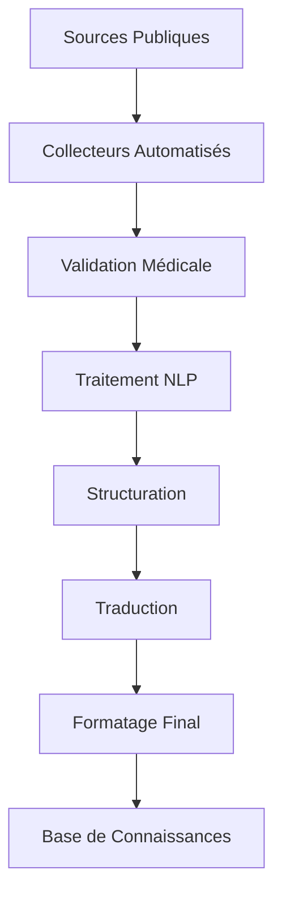

# Module 2: Collecte et Préparation Données Médicales 📊

## Description
Module spécialisé pour la collecte, traitement et préparation de données médicales publiques pour l'Hôpital Général de Douala. Ce système automatise la collecte de 200+ documents médicaux depuis des sources fiables (WHO, CDC, etc.) et les prépare pour l'intégration dans le système RAG.

## 🎯 Objectifs

- **Collecter 200+ documents** médicaux publics de sources fiables
- **Créer un corpus français** sur maladies courantes
- **Structurer par catégories** (diagnostics, traitements, médicaments)
- **Nettoyer et formater** pour embeddings optimaux
- **Créer fiches explicatives** en langage simple
- **Valider l'exactitude** médicale des sources
- **Traduire en langues locales** (français, anglais, langues camerounaises)
- **Organiser hiérarchie thématique** des connaissances

## 🏗️ Architecture



## 📁 Structure

```
module2_data_collection/
├── 📁 collectors/          # Scripts de collecte
├── 📁 processors/          # Traitement des données
├── 📁 validators/          # Validation médicale
├── 📁 translators/         # Système de traduction
├── 📁 formatters/          # Formatage final
├── 📁 data/               # Données collectées
│   ├── raw/               # Données brutes
│   ├── processed/         # Données traitées
│   ├── validated/         # Données validées
│   └── final/             # Données finales
├── 📁 sources/            # Configuration des sources
├── 📁 templates/          # Templates de fiches
├── 📁 scripts/            # Scripts utilitaires
└── 📄 requirements.txt    # Dépendances
```

## 🚀 Fonctionnalités

### Collecte Automatisée
- Collecteurs pour WHO, CDC, OMS, Ministère Santé Cameroun
- Scraping intelligent avec respect des robots.txt
- Détection automatique de nouveaux contenus
- Gestion des formats multiples (PDF, HTML, DOC)

### Traitement Intelligent
- Extraction de texte optimisée
- Nettoyage et normalisation
- Détection de langue automatique
- Segmentation par sections médicales

### Validation Médicale
- Vérification des sources
- Contrôle de cohérence
- Détection d'informations obsolètes
- Scoring de fiabilité

### Organisation Thématique
- Classification automatique par spécialité
- Hiérarchie des connaissances
- Tags et métadonnées enrichies
- Relations entre concepts

## ⚡ Installation

```bash
cd module2_data_collection
python install.py
```

## 📚 Utilisation

### Collecte complète
```bash
python scripts/collect_all.py
```

### Collecte par source
```bash
python scripts/collect_who.py
python scripts/collect_cdc.py
```

### Traitement et validation
```bash
python scripts/process_and_validate.py
```

---

**🏥 Hôpital Général de Douala - Module de Collecte de Données 2024**