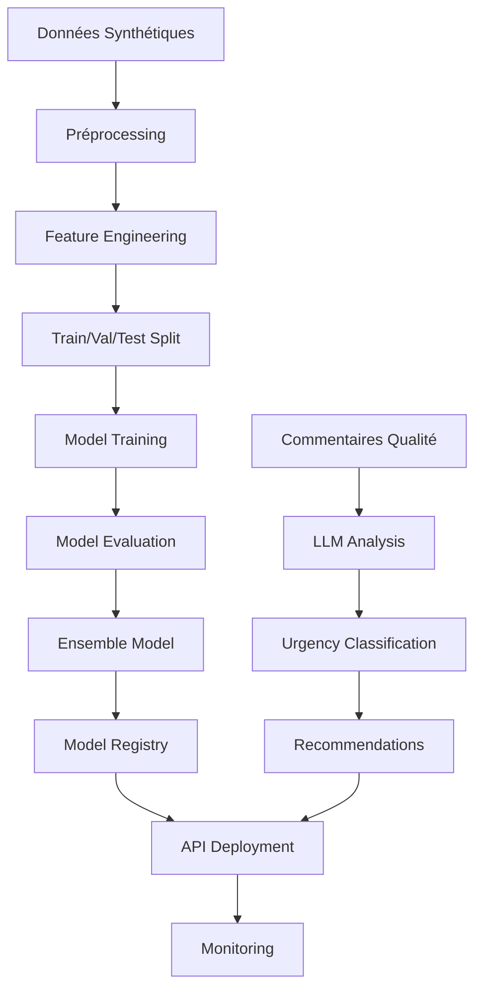

# Documentation Technique - Système MLOps de Prédiction des Stocks de Sang

## 🏥 Hôpital Général Douala - Module 1: ML/IA + LLM + MLOps

### Vue d'ensemble du Système

Ce système MLOps complet combine l'apprentissage automatique, l'intelligence artificielle et les LLM pour prédire et analyser les stocks de sang en temps réel. Il est conçu pour l'Hôpital Général Douala dans le cadre d'un hackathon 2024.

---

## 🏗️ Architecture du Système

### Composants Principaux

```
📦 blood-stock-ml-system/
├── 🔧 MLOps Pipeline
│   ├── MLflow (Tracking & Registry)
│   ├── DVC (Data & Model Versioning)
│   └── GitHub Actions (CI/CD)
├── 🤖 ML Models
│   ├── ARIMA (Time Series)
│   ├── XGBoost (Multi-variable)
│   ├── LSTM (Deep Learning)
│   └── Ensemble (Voting)
├── 🧠 LLM Integration
│   ├── OpenAI API
│   ├── HuggingFace Models
│   └── Local Transformers
├── 🚀 Deployment
│   ├── FastAPI Service
│   ├── Docker Container
│   └── Cloud Platforms
└── 📊 Monitoring & Analytics
```

### Flux de Données



---

## 📊 Modèles d'Apprentissage Automatique

### 1. ARIMA (AutoRegressive Integrated Moving Average)

**Objectif**: Prédiction de séries temporelles pour les stocks de sang

**Caractéristiques**:
- Modélisation des tendances et saisonnalités
- Optimisation automatique des paramètres (p, d, q)
- Validation croisée temporelle
- Métriques: MAE, RMSE, MAPE

**Implémentation**:
```python
class ARIMAPredictor:
    def find_optimal_order(self, series, max_p=5, max_d=2, max_q=5)
    def train_model(self, data, hospital, blood_type)
    def predict(self, steps=30)
    def evaluate_model(self, test_data)
```

### 2. XGBoost (Extreme Gradient Boosting)

**Objectif**: Prédiction multi-variable avec features complexes

**Caractéristiques**:
- Optimisation d'hyperparamètres avec Optuna
- Features d'interaction et lag features
- Importance des features
- Cross-validation 5-fold

**Features Utilisées**:
- Stock initial, demande, approvisionnement
- Température, jours d'expiration
- Score de qualité, urgence
- Features temporelles (jour, mois, saison)
- Features cycliques (sin/cos)
- Rolling statistics (moyennes mobiles)

### 3. LSTM (Long Short-Term Memory)

**Objectif**: Apprentissage profond pour séquences temporelles

**Architecture**:
```python
model = Sequential([
    LSTM(128, return_sequences=True, input_shape=(sequence_length, n_features)),
    Dropout(0.2),
    LSTM(64, return_sequences=False),
    Dropout(0.2),
    Dense(32, activation='relu'),
    Dense(1)
])
```

**Caractéristiques**:
- Séquences de 30 jours
- Early stopping et learning rate scheduling
- Validation temporelle
- Sauvegarde des meilleurs modèles

### 4. Ensemble Model

**Méthodes de Combinaison**:
1. **Weighted Average**: Pondération basée sur les performances
2. **Stacking**: Meta-modèle pour combiner les prédictions
3. **Voting**: Vote majoritaire ou moyenné

**Optimisation des Poids**:
```python
def calculate_optimal_weights(self, predictions, targets):
    # Optimisation basée sur les métriques de performance
    weights = minimize(objective_function, initial_weights)
    return weights
```

---

## 🧠 Intégration LLM

### Analyse des Commentaires de Qualité

**Modèles Utilisés**:
- **Sentiment Analysis**: `cardiffnlp/twitter-roberta-base-sentiment-latest`
- **Embeddings**: `sentence-transformers/all-MiniLM-L6-v2`
- **OpenAI API**: GPT-3.5/4 pour analyse avancée

**Pipeline d'Analyse**:
1. **Préprocessing**: Nettoyage et normalisation du texte
2. **Extraction de Keywords**: TF-IDF et mots-clés d'urgence
3. **Classification d'Urgence**: Règles + ML + LLM
4. **Génération de Recommandations**: Prompts structurés

**Niveaux d'Urgence**:
- **CRITIQUE** (80-100): Action immédiate requise
- **ÉLEVÉE** (60-79): Attention dans les 24h
- **MOYENNE** (40-59): Surveillance renforcée
- **FAIBLE** (0-39): Routine normale

### Prompts Engineering

```python
URGENCY_ANALYSIS_PROMPT = """
Analysez ce commentaire sur la qualité du sang et classifiez le niveau d'urgence:

Commentaire: {comment}
Contexte: Stock={stock}, Expiration={expiry} jours, Score qualité={quality}

Évaluez:
1. Niveau d'urgence (0-100)
2. Facteurs de risque identifiés
3. Actions recommandées
4. Priorité de traitement

Format de réponse JSON:
{{
  "urgency_score": <0-100>,
  "urgency_level": "<CRITIQUE|ÉLEVÉE|MOYENNE|FAIBLE>",
  "risk_factors": ["facteur1", "facteur2"],
  "recommendations": ["action1", "action2"],
  "priority": "<IMMÉDIATE|24H|SURVEILLANCE|ROUTINE>"
}}
"""
```

---

## 🔄 Pipeline MLOps

### MLflow Integration

**Tracking des Expériences**:
```python
with mlflow.start_run(run_name=f"{model_name}_training"):
    mlflow.log_params(hyperparameters)
    mlflow.log_metrics(performance_metrics)
    mlflow.log_artifacts(model_artifacts)
    mlflow.sklearn.log_model(model, "model")
```

**Métriques Trackées**:
- MAE (Mean Absolute Error)
- RMSE (Root Mean Square Error)
- MAPE (Mean Absolute Percentage Error)
- R² Score
- Training/Validation Loss
- Feature Importance

### DVC (Data Version Control)

**Configuration**:
```yaml
# .dvc/config
[core]
    remote = s3-storage
    analytics = false
    check_update = false

['remote "s3-storage"']
    url = s3://blood-stock-data-bucket
    access_key_id = ${AWS_ACCESS_KEY_ID}
    secret_access_key = ${AWS_SECRET_ACCESS_KEY}
```

**Pipeline DVC**:
```yaml
# dvc.yaml
stages:
  data_generation:
    cmd: python src/data_generation/generate_synthetic_data.py
    outs:
      - data/synthetic/blood_stock_data.csv
  
  preprocessing:
    cmd: python src/preprocessing/data_preprocessor.py
    deps:
      - data/synthetic/blood_stock_data.csv
    outs:
      - data/processed/
  
  train_models:
    cmd: python src/training/train_all_models.py
    deps:
      - data/processed/
    outs:
      - models/
    metrics:
      - evaluation/metrics.json
```

### GitHub Actions CI/CD

**Workflow Principal**:
```yaml
name: ML Pipeline
on:
  push:
    branches: [main, develop]
  pull_request:
    branches: [main]
  schedule:
    - cron: '0 2 * * 1'  # Weekly retrain

jobs:
  test:
    runs-on: ubuntu-latest
    steps:
      - uses: actions/checkout@v3
      - name: Setup Python
        uses: actions/setup-python@v4
        with:
          python-version: '3.9'
      - name: Install dependencies
        run: pip install -r requirements.txt
      - name: Run tests
        run: pytest tests/ --cov=src/
  
  train:
    needs: test
    if: contains(github.event.head_commit.message, '[retrain]') || github.event_name == 'schedule'
    runs-on: ubuntu-latest
    steps:
      - name: Train models
        run: python src/training/train_all_models.py
      - name: Validate performance
        run: python scripts/evaluate_all_models.py
  
  deploy:
    needs: [test, train]
    if: github.ref == 'refs/heads/main'
    runs-on: ubuntu-latest
    steps:
      - name: Build Docker image
        run: docker build -t blood-stock-ml:${{ github.sha }} .
      - name: Deploy to production
        run: python scripts/deploy_model.py
```

---

## 🚀 API et Déploiement

### FastAPI Service

**Endpoints Principaux**:

```python
@app.post("/predict")
async def predict_blood_stock(
    request: PredictionRequest
) -> PredictionResponse:
    """Prédiction des stocks de sang"""
    
@app.post("/analyze")
async def analyze_quality_comments(
    request: AnalysisRequest
) -> AnalysisResponse:
    """Analyse LLM des commentaires"""
    
@app.post("/recommend")
async def get_recommendations(
    request: RecommendationRequest
) -> RecommendationResponse:
    """Recommandations intelligentes"""
```

**Features de l'API**:
- Rate limiting (100 req/min)
- Cache Redis pour les prédictions
- Validation des données d'entrée
- Gestion d'erreurs robuste
- Monitoring des performances
- Health checks automatiques

### Containerisation Docker

**Dockerfile Optimisé**:
```dockerfile
FROM python:3.9-slim

# Optimisations de sécurité
RUN groupadd -r mluser && useradd -r -g mluser mluser

# Installation des dépendances système
RUN apt-get update && apt-get install -y \
    gcc g++ \
    && rm -rf /var/lib/apt/lists/*

# Installation Python
COPY requirements.txt .
RUN pip install --no-cache-dir -r requirements.txt

# Copie du code
COPY --chown=mluser:mluser . /app
WORKDIR /app
USER mluser

# Health check
HEALTHCHECK --interval=30s --timeout=10s --start-period=60s \
  CMD curl -f http://localhost:8000/health || exit 1

EXPOSE 8000
CMD ["./docker-entrypoint.sh"]
```

### Déploiement Multi-Platform

**HuggingFace Spaces**:
```python
def deploy_to_huggingface(space_name: str, token: str):
    """Déploiement sur HuggingFace Spaces"""
    api = HfApi(token=token)
    api.create_repo(
        repo_id=space_name,
        repo_type="space",
        space_sdk="docker"
    )
    api.upload_folder(
        folder_path=".",
        repo_id=space_name,
        repo_type="space"
    )
```

**Google Cloud Run**:
```python
def deploy_to_cloud_run(project_id: str, region: str):
    """Déploiement sur Google Cloud Run"""
    # Build et push de l'image
    subprocess.run([
        "gcloud", "builds", "submit",
        "--tag", f"gcr.io/{project_id}/blood-stock-ml"
    ])
    
    # Déploiement du service
    subprocess.run([
        "gcloud", "run", "deploy", "blood-stock-ml",
        "--image", f"gcr.io/{project_id}/blood-stock-ml",
        "--region", region,
        "--allow-unauthenticated"
    ])
```

---

## 📊 Monitoring et Observabilité

### Métriques de Performance

**Métriques ML**:
- Accuracy des prédictions en temps réel
- Drift detection des données
- Distribution des erreurs
- Latence des prédictions

**Métriques Système**:
- CPU/Memory utilization
- Request throughput
- Error rates
- Response times

**Métriques Business**:
- Nombre de prédictions par hôpital
- Taux d'urgence détectés
- Économies réalisées
- Satisfaction utilisateur

### Alertes et Notifications

```python
class AlertManager:
    def check_model_performance(self):
        """Vérification des performances du modèle"""
        if current_mae > baseline_mae * 1.2:
            self.send_alert(
                "Model Performance Degradation",
                f"MAE increased to {current_mae:.4f}"
            )
    
    def check_data_drift(self):
        """Détection de drift des données"""
        drift_score = calculate_drift_score()
        if drift_score > 0.7:
            self.send_alert(
                "Data Drift Detected",
                f"Drift score: {drift_score:.3f}"
            )
```

---

## 🔒 Sécurité et Conformité

### Sécurité des Données

- **Chiffrement**: Toutes les données sensibles sont chiffrées
- **Authentification**: API keys et tokens sécurisés
- **Autorisation**: Contrôle d'accès basé sur les rôles
- **Audit**: Logs complets des accès et modifications

### Conformité RGPD

- **Anonymisation**: Données synthétiques uniquement
- **Droit à l'oubli**: Suppression des données sur demande
- **Transparence**: Documentation complète des traitements
- **Minimisation**: Collecte limitée aux données nécessaires

### Bonnes Pratiques

```python
# Gestion sécurisée des secrets
import os
from cryptography.fernet import Fernet

class SecretManager:
    def __init__(self):
        self.cipher = Fernet(os.environ['ENCRYPTION_KEY'])
    
    def encrypt_secret(self, secret: str) -> str:
        return self.cipher.encrypt(secret.encode()).decode()
    
    def decrypt_secret(self, encrypted_secret: str) -> str:
        return self.cipher.decrypt(encrypted_secret.encode()).decode()
```

---

## 🧪 Tests et Validation

### Tests Automatisés

**Tests Unitaires**:
```python
class TestBloodStockPredictor:
    def test_data_preprocessing(self):
        """Test du préprocessing des données"""
        
    def test_model_training(self):
        """Test de l'entraînement des modèles"""
        
    def test_prediction_accuracy(self):
        """Test de la précision des prédictions"""
```

**Tests d'Intégration**:
```python
class TestAPIEndpoints:
    def test_prediction_endpoint(self):
        """Test de l'endpoint de prédiction"""
        
    def test_analysis_endpoint(self):
        """Test de l'endpoint d'analyse LLM"""
        
    def test_recommendation_endpoint(self):
        """Test de l'endpoint de recommandations"""
```

**Tests de Performance**:
```python
def test_prediction_latency():
    """Vérification que les prédictions sont < 2 secondes"""
    start_time = time.time()
    prediction = model.predict(test_data)
    latency = time.time() - start_time
    assert latency < 2.0
```

### Validation Temporelle

```python
class TemporalValidator:
    def backtest_model(self, model, data, window_size=30):
        """Validation temporelle avec backtesting"""
        results = []
        for i in range(len(data) - window_size):
            train_data = data[:i+window_size]
            test_data = data[i+window_size:i+window_size+1]
            
            model.fit(train_data)
            prediction = model.predict(test_data)
            actual = test_data['target'].values[0]
            
            results.append({
                'prediction': prediction,
                'actual': actual,
                'error': abs(prediction - actual)
            })
        
        return pd.DataFrame(results)
```

---

## 📈 Optimisations et Améliorations

### Optimisations de Performance

1. **Cache Intelligent**:
   - Cache Redis pour les prédictions fréquentes
   - TTL adaptatif basé sur la volatilité
   - Invalidation intelligente

2. **Parallélisation**:
   - Training parallèle des modèles
   - Batch processing pour les analyses LLM
   - Async/await pour l'API

3. **Optimisation Mémoire**:
   - Lazy loading des modèles
   - Garbage collection optimisé
   - Streaming pour les gros datasets

### Améliorations Futures

1. **AutoML Integration**:
   - Recherche automatique d'architecture
   - Optimisation continue des hyperparamètres
   - Sélection automatique des features

2. **Federated Learning**:
   - Entraînement distribué entre hôpitaux
   - Préservation de la confidentialité
   - Modèles personnalisés par établissement

3. **Real-time Streaming**:
   - Apache Kafka pour les données en temps réel
   - Prédictions en streaming
   - Alertes instantanées

---

## 🛠️ Guide de Maintenance

### Maintenance Préventive

**Hebdomadaire**:
- Vérification des performances des modèles
- Analyse des logs d'erreur
- Mise à jour des dépendances de sécurité

**Mensuelle**:
- Ré-entraînement des modèles
- Optimisation des hyperparamètres
- Nettoyage des caches et logs

**Trimestrielle**:
- Audit de sécurité complet
- Révision de l'architecture
- Mise à jour majeure des dépendances

### Procédures de Récupération

```python
class DisasterRecovery:
    def backup_models(self):
        """Sauvegarde des modèles"""
        
    def restore_from_backup(self, backup_date):
        """Restauration depuis une sauvegarde"""
        
    def rollback_deployment(self, previous_version):
        """Rollback vers une version précédente"""
```

**Documentation Additionnelle**:
- [Guide d'Installation](./INSTALLATION.md)
- [Guide Utilisateur](./USER_GUIDE.md)
- [FAQ](./FAQ.md)
- [Changelog](./CHANGELOG.md)
